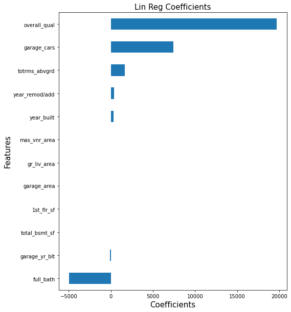

# Project 2 - Ames Iowa Housing Predictability

### Problem Statement:

As a Data Scientist within XYZ, llc. I have been tasked with finding a model that can help predict home sale prices in the Ames, Iowa market (A Market XYZ is looking to expand into). XYZ generates revenue by selling advertising to businesses in the local area, and they base these rates on in specific neighborhood values. This value is derived by accurately predicting the sale price of the houses in that area. There are several factors that go into calculating these values, let's dive into it with Linear Regression! Our goal is to produce the model with the highest R2 score.

### Research:

As evidenced by XYZ's business model, the location plays a big importance. Not only for us, but also for the values of the properties we are estimating. House value can be summarized by looking at the following data:
 
1. Historical Sale Prices
2. Neighborhood
3. The Market
4. Size and Appeal
5. Age and Condition
6. Nearby Features

Source: https://www.inman.com/2017/08/07/6-factors-that-influence-a-homes-value/

Luckily for us, XYZ has been great at scraping data on the housing market in the area! We will be able to examine in more depth points 1, 2, 4, and 5.

### Datasets

The data set we will primarily be looking at is on the Ames Iowa housing market and spans from houses that were sold from 2006-2010. There are over 80 columns of data, with over 30 consiting of numeric values, while the rest are categorical.

[Link to Data Dictionary](https://www.kaggle.com/c/dsir-1011-project-2-regression-challenge/data)

### Data Analysis and Visualization

Since no data is without flaw, several of the columns mentioned below in analysis may have had missing values. A lot did not, but of the ones mentioned, the following imputing strategy was performed. If the data was numerical, summary statistics were examined along with value counts. Best judgement was used when filling out data. For most that made sense, the mean was used to impute NaN values, for other it would be the mode(most of the time = 0)

One of the first way to get a good sense of the numerical data is to perform a correlation heatmap so that a good sense of what numerically already looks to have a good relationship with the sale price of a house. 

As you can see from the heatmap, theses 12 features have the highest correlation with salesprice and are a good place to start diving deeper.

Let's look at just 2 features so that we visually understand what the affect has on sale price. For our example, let's look at Quality and gr_liv_area. In order to create a better model, we will need to feature engineer to create an even better quality column. To do this, we are going to change 3 categorical columns into numerical ones and multiply them all together.

- overall_qual (numerical)
- exter_qual (categorical)
- heating_qc (categorical)
- kitchen_qual (categorical)

After we have calculated all columns to be numerical and multiplied all by each other, we have a new column we are labeling **Total Quality**. With this new info, let's see how a multiple linear regression performs with 2 features (Total Quality & gr_live_area) against actual sale prices.

As we can see by the R2 score of .77, we can see that there is a general positive relationship between those data features and the sale price. Unfortunately, we need something more accurate that .77, but it is a good start in order to see where we stand from an initial model.

Before we continue, let's look at the data in 2 buckets (Numerical & Categorical). Let's start by creating a mlr using only Numerical Data. Going back to look at our correlations, if we take the top 12 correlations and create features we have the following coefficient table:

We have achieved an R2 of 0.76 for only numerical, a downgrade on our original set, but it gives a good look at the coefficients and their relative weights. Looking at these coefficients, we can see that there is a high emphasis put on the overall quality. 

If we do the same thing but from a categorical point of view looking at location/house info, we produce columns based on House Style, Neighborhood, Lot Shape, and MS Zoning. After we have the data transformed, if we perform a mlr against home sale prices we receive the following coefficients:

With the above model, we were able to increase our R2 score to 0.83, so a better model!

As we look to improve our model we are now going to introduce 2 things at once to our model!

Let's first revisit the top 6 corelated features with sales price:

The first will be feature engineering our numerical columns with **Polynomial Features**. Adding these features greatly increases the amount of column calculations and will provide the linear regression with a better score on the model.

After that, we will be adding **categorical column** data on House Style, Lot Shape, and MS Zoning. This will give us a good sense on additional data that will be pertinent to our model becoming more clear.

When we combine both of these into a single data frame (43 features total) and perform a linear regression, we achieve a R2 score of 0.87. This is a great improvemennt and provides an even clearer model for us to predict housing prices. Now with the features that we have specificed, we can say that roughly 87% of the housing data is influenced by our features. This is a great step towards finding a good model for our future predictions at XYZ.

Having a lot of features is great, but what if we wanted to cut back on some while maintaining relatively the same R2 score? This is where we will introduce Lasso Regression. With Lasso Regression, we will be able to see what features are actually important and which are not. One important thing to note on Lasso Regression, all numerical data (besides dummy data) must be scaled, this is how the model punishes large magnitudes that may be pulling the data a certain direction.

After scaling the above example and implementing Lasso Regression we have the following coefficients:

The Lasso Model has producted the same R2 score of 0.87, while cutting down on the number of features required by over half!

Since Lasso sets feature coefficients to 0 if they are not important, we are greatly able to cut back on required features for the model. We have taken our features required from 43 down to 21 through this technique!

Due to time constraints, this presentation model analysis stops at this point, but pushing the models and producing more feature engineering will produce higher and higher R2 scores while reducing errors.

### Conclusion and Findings:

Through the use of several techniques and model iterations, I have been able to produce a Lasso model that has produced a R2 score of 0.87, while using only 21 features for analysis. This is a great start into this model, and with more time and analysis, the model will only be made better.

